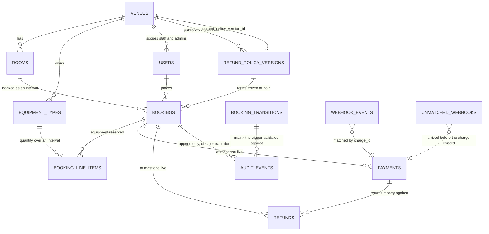
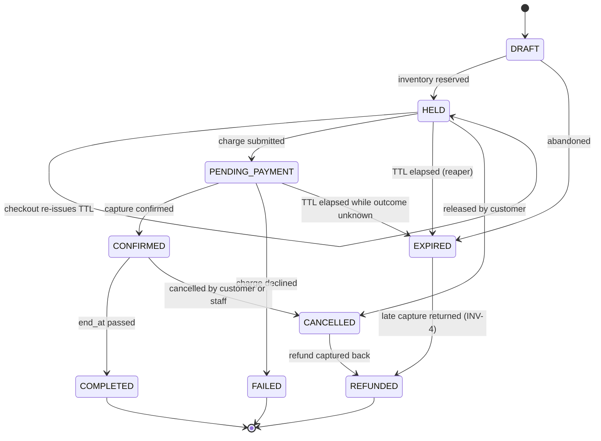

# ARCHITECTURE.md

## 0. Stack

**PostgreSQL.** The concurrency model needs EXCLUDE USING gist, range types, generated columns. MySQL doesn't have exclusion constraints — it would fall back to check-then-insert, which is the failure mode the brief warns about.

**TypeScript + Fastify.** Python + FastAPI would work as well. I picked what I know — under a 24-hour clock with a live defense, the stack I write without thinking is the right one.

**No ORM — plain `pg`.** Prisma can't express exclusion constraints, triggers, FOR UPDATE, or REVOKE. Every one of those is something this design depends on. It would be bypassed at the points that matter while still costing setup and a query engine binary. Hand-written SQL in repositories, plain `.sql` migrations.

---

## 1. Entity relationship diagram

Migrations in `db/migrations/`. The diagram is the schema.



Eight entities from the brief: VENUES, ROOMS, EQUIPMENT_TYPES, USERS, BOOKINGS, BOOKING_LINE_ITEMS, PAYMENTS, AUDIT_EVENTS.

Five I added:

| Table | Why |
|---|---|
| `REFUND_POLICY_VERSIONS` | Policy is data, append-only, booking holds a pointer |
| `REFUNDS` | Own lifecycle, own idempotency, reconcilable independently |
| `WEBHOOK_EVENTS` | Dedup on `(charge_id, event_type)` + retry state |
| `UNMATCHED_WEBHOOKS` | 25% of webhooks arrive before the charge is recorded — expected, not exceptional |
| `BOOKING_TRANSITIONS` | State machine as data, trigger validates against it |

### Constraints that do the work

| Where | What it does |
|---|---|
| `bookings.reserved_range` GENERATED | 15-min turnaround is geometry, not validation. No code path, including seeds, can bypass it |
| `EXCLUDE USING gist` on `bookings` | INV-1 enforced at write time by the index |
| `users.role_venue_agreement` | A venue-scoped role with no venue would scope to nothing and read everything. A platform admin with a venue would look scoped and not be. The DB won't store either |
| `one_live_charge_per_booking` | INV-3 at the database level, independent of what the application does |
| `one_live_refund_per_booking` | Second line of defence behind the state machine for double-clicked cancel |
| `half_hour_granularity`, `duration_bounds` | Operating rules as data constraints — not validation a new endpoint might skip |
| `REVOKE UPDATE, DELETE` (006) | Append-only for audit_events as privileges |

---

## 2. Booking state machine



### Transition matrix — enforced by a BEFORE UPDATE trigger

| From | To | Inventory | Money |
|---|---|---|---|
| `DRAFT` | `HELD` | reserved | — |
| `DRAFT` | `EXPIRED` | — | — |
| `HELD` | `HELD` | held | — |
| `HELD` | `PENDING_PAYMENT` | held | charge out |
| `HELD` | `EXPIRED` | released | — |
| `HELD` | `CANCELLED` | released | — |
| `PENDING_PAYMENT` | `CONFIRMED` | committed | captured |
| `PENDING_PAYMENT` | `FAILED` | released | — |
| `PENDING_PAYMENT` | `EXPIRED` | released | still in flight |
| `CONFIRMED` | `COMPLETED` | consumed | — |
| `CONFIRMED` | `CANCELLED` | released | refund intent written |
| `CANCELLED` | `REFUNDED` | — | returned |
| `EXPIRED` | `REFUNDED` | — | returned |

Terminal: COMPLETED, FAILED, REFUNDED, CANCELLED (when policy returns zero).

Blocking states (the ones the exclusion constraint and equipment check count): HELD, PENDING_PAYMENT, CONFIRMED.

### Failure edges — what happens when Paygate misbehaves

Paygate is deliberately unreliable. These are the transitions its chaos modes produce:

| Attempted | Why it's refused | Response |
|---|---|---|
| `EXPIRED` → `CONFIRMED` | INV-4 — delayed webhook delivery (5% chance, 60-90s delay) | Not a simple refusal — see below |
| `CONFIRMED` → `CONFIRMED` | Duplicate webhook (30%). The uniqueness constraint on `(charge_id, event_type)` catches it first | 200 no-op |
| `CANCELLED` → `CONFIRMED` | Money already returned, slot may be rebooked | 409 |
| `CANCELLED` → `CANCELLED` | Repeat cancel — not a transition, it's a replay | 200, return the existing refund info |
| `COMPLETED` → `CANCELLED` | Booking already happened | 409 |
| `FAILED` → `PENDING_PAYMENT` | Hold is gone, need a new booking | 409 |
| `EXPIRED` → `HELD` | Slot was released, someone else may hold it | 409 |

**EXPIRED → CONFIRMED is different.** Rejecting it would leave captured money against a booking that will never exist. The handler finds the booking expired, doesn't attempt the transition, writes a refund intent instead, and audits the whole sequence — the late arrival, the refusal, and the refund. The booking goes EXPIRED → REFUNDED.

The trigger validates `(from_state, to_state)` and writes the AuditEvent in the same statement. No code path can change state without being checked and audited. Illegal transitions return 409, never 500.

---

## 3. Concurrency strategy

**The problem:** two inventory types with different constraints, 200 people racing for the last slot, three API replicas behind a load balancer. No mutex, semaphore, or in-process map — those work on one process and fail on three. The database is the only component all replicas share, so that's where the guarantees live.

The naive approach — "SELECT for conflicts, then INSERT" — has a window between the read and the write where both callers see an empty slot. Every mechanism below closes that window by making the check and the write the same operation.

### 3.1 Rooms — GiST exclusion constraint

Rooms can't overlap. Postgres enforces that with an exclusion constraint on the range column:

```sql
CREATE EXTENSION IF NOT EXISTS btree_gist;

ALTER TABLE bookings ADD CONSTRAINT no_room_overlap
  EXCLUDE USING gist (
    room_id       WITH =,
    reserved_range WITH &&
  )
  WHERE (status IN ('HELD', 'PENDING_PAYMENT', 'CONFIRMED'));
```

`reserved_range` is a generated `tstzrange` of `[start_at, end_at + 15 minutes)`. The 15-minute turnaround is built into the geometry — no code path, seed script, or admin override can bypass it, because the range itself is longer than the booking.

**Why it holds:** the constraint is enforced by the index at write time, under the row lock Postgres takes for the insert. Two transactions trying overlapping ranges on the same room block until the first resolves. The second either sees the committed row and raises `23P01`, or proceeds if the first rolled back. There's no window because there's no separate check.

`23P01` is caught at the repository boundary and mapped to 409. Never a 500.

### 3.2 Equipment — row lock + interval peak check

Equipment can't use the same approach — exclusion constraints can't express "at most N." So inside the same transaction as the booking insert: lock the equipment type row with `SELECT ... FOR UPDATE`, run the capacity check, then insert the line items. All contending transactions for that equipment type serialize behind that one row lock.

**The capacity check is the part that's easy to get wrong.** A naive sum of quantities over the requested window counts units that are never simultaneously out. A venue with 6 cameras, two bookings of 1 camera each at 09:00-10:00 and 10:00-11:00 — a request for 09:00-11:00 should pass with 2 units used (peak is 1), not fail with 6. 

The correct question: what's the maximum concurrent reservation at any instant inside the window? Usage changes only at booking boundaries, so check at candidate points: the requested `start_at` plus every overlapping booking's `start_at`. Admissible iff `max(point_sums) + requested_qty <= effective_capacity` where `effective_capacity = floor(units_owned * (1 + overbooking_buffer))`.

### 3.3 Across three replicas

Neither mechanism has process-local state, so replica count changes throughput and lock-wait distribution — not correctness. A request on replica 2 contends through the same GiST index entry and row lock as one on replica 3.

The concurrency proof runs against nginx fronting three API containers in `docker compose`, not against a single process. A proof against one instance would not distinguish this from an in-process mutex, which is the distinction being tested.

Actual run:

```
PHASE A  one room, one slot, 200 concurrent holds
201: 1    409: 199    replicas: api-1, api-2, api-3
  PASS  exactly 1 booking, all others 409, zero 5xx, all replicas

PHASE B  200 distinct rooms, EquipmentType owning 3 units
201: 3    409: 197
  PASS  at most 3 units, zero 5xx, no duplicate successes
```

Phase B is the meaningful one — 200 different rooms means the room constraint can't limit the result. The only thing that produced exactly 3 successes is the equipment check.

### 3.4 Expired holds

A hold past its TTL but not yet reaped still blocks its slot — the exclusion constraint's WHERE clause can't reference `now()` (index predicates must be IMMUTABLE). So the system may transiently under-sell but never oversell. That's the correct direction to fail.

A background reaper transitions rows past `expires_at` to EXPIRED once per worker tick, through the same trigger as any other transition, so each expiry is validated and audited. Idempotent and safe on all three replicas.

It covers `PENDING_PAYMENT` as well as `HELD`. `bookings_reaper_idx` was partial on HELD alone (007), which left out the one state INV-4 is about — a hold that runs out while the charge is in flight. Migration 010 widens it.

What the absence of a reaper costs, measured rather than argued: 6,401 unreaped holds accumulated locally, and the 200-request concurrency proof began failing on 504s and pool timeouts while INV-1 itself still held. Expiring them restored it. The slot was never double-booked; the system just stopped being able to answer.

### 3.5 Transition enforcement

`UPDATE bookings SET status = ?` scattered across controllers is a fail. A BEFORE UPDATE trigger validates `(from_state, to_state)` against the transition matrix and writes the AuditEvent in the same statement. Exactly one AuditEvent per transition is structurally true, not conventionally enforced.

UPDATE and DELETE are revoked on `audit_events`. Except: the app connects as the database owner (both in docker compose and on free hosting), and an owner can't be revoked from its own tables. Migration 008 adds triggers that reject the mutation from any role. Both are kept — the privilege is the right mechanism for production, the trigger is the one actually fastened here.

Migration 009 closes the remaining hole:

- `TRUNCATE` produces no row events, so the 008 row triggers never fired for it. The trail was removable in one statement.
- Statement-level `BEFORE TRUNCATE` guards on `audit_events`, `refund_policy_versions`, `booking_transitions`.
- A cascaded truncate fires the guard on the cascaded table, so `TRUNCATE bookings CASCADE` is refused too.
- The seed resets these tables by disabling the guards explicitly. `ALTER TABLE ... DISABLE TRIGGER` requires ownership, which `atrium_app` does not hold under 006. DDL is transactional, so a failed seed restores them on rollback.
- `tests/append-only.test.ts` — 8 cases, including the cascade path.

---

## 4. Payment integrity model

> Section numbers 4A–4D live under §4 to keep the 8 positions the brief asks for stable. They span tenant isolation, refund policy, cancellation idempotency, and background work — each is a distinct design concern, not a sub‑problem of payment.

The problem: Paygate delivers webhooks at-least-once, potentially out of order, and sometimes before it returns the 202. X-Paygate-Delivery is new on every attempt — useless as a dedup key. The uniqueness constraint is on `(charge_id, event_type)`.

- Idempotency key derived deterministically from the payment attempt, persisted before the outbound call
- `UNIQUE (booking_id) WHERE status IN ('PENDING','CAPTURED')` — at most one live charge per booking (INV-3)
- HMAC verified against the raw request body before parsing. Invalid → 401, logged, never processed
- Webhook for an unknown charge (25% race where the callback beats the 202) persisted to `unmatched_webhooks`, returns 200, resolved by a sweeper
- Handler: verify → dedup insert → enqueue → 200. No heavy work inline
- INV-4: if the hold has expired when a capture webhook lands, the booking routes to refund, not CONFIRMED
- INV-5: append-only money ledger. Reconciliation is three anti-joins: captures with no CONFIRMED booking, CONFIRMED bookings with no capture, refunds with no matching capture

## 4A. Tenant isolation (INV-6)

Every repository method that can return a row the caller has not already proved access to takes an `AuthScope` as its first parameter, and turns it into a predicate the query carries: `venue_id = $1` for venue-scoped roles, `user_id = $1` for CUSTOMER on their own bookings, unrestricted for PLATFORM_ADMIN. The predicate is derived from the scope, not chosen by the caller.

The rest take an explicit `venue_id` that the calling service obtained from a scoped read — `lockTypes`, `localWindow`, `insertHold`. They cannot widen what the caller may reach, because the venue is already fixed by the time they run.

Two exceptions, both deliberate. `userRepo.findByEmail` runs before the caller has an identity and is the only function in its file for that reason. `systemRepo` reads no tenant data.

An earlier version of this section claimed every repository method took a scope. When the layers were split it stopped being true of `roomRepo.findForBooking`, which read any venue's room and left the check to the one service that happened to perform it — INV-6 is a hard cap, and it had come to depend on every future caller remembering. The predicate is in the query now.

I chose this over Postgres RLS because RLS has a pooling problem: a session variable left set on a returned connection serves the next request under the previous tenant's scope. That's a new isolation failure created by the isolation mechanism, and INV-6 is a scoring hard cap. RLS also needs bypasses for PLATFORM_ADMIN and the unscoped workers, plus two policies per table because CUSTOMER scopes by user_id rather than venue_id. RLS is the right next step but repository scoping is the right choice here.

Cross-venue reads return 404, not 403. A 403 confirms the resource exists, which tells someone probing by UUID that another venue's data is there.

## 4B. Refund policy model

Two requirements that pull: policy is data (an admin changes tiers through the API, no deployment) vs. no retroactive change to an already CONFIRMED booking.

I use immutable policy versions. `refund_policy_versions` is append-only — an admin editing tiers inserts a new version, the venue's pointer moves to it. Every booking stores the `policy_version_id` in force at creation, and the refund calculator reads terms through that reference, never through the venue's current version. The platform default is itself a version, so a venue that has never set a policy still has a pointer to a real row.

I rejected mutable rows with terms copied onto each booking — equally correct, but duplicates terms on every row and gives no policy history. I also rejected letting an admin flag an edit as a "correction" that applies retroactively. The system can't verify a claimed correction, and it would put the decision of whether a change is retroactive in the admin's hands, turning the guarantee into a setting. Genuine mistakes are handled as audited per-booking adjustments (A10).

## 4C. Cancellation and refund idempotency

Make the cancellation idempotent, not the refund. CONFIRMED → CANCELLED serializes under the state machine trigger's row lock — only one can succeed. The refund intent is written in the same transaction:

```
one transaction:
  bookings      → CANCELLED  (trigger validates, writes AuditEvent)
  refunds       → INSERT status = 'PENDING', amount from booking's policy version
```

Both commit or neither. A worker drives PENDING to Paygate with Idempotency-Key derived from the refund row id. `UNIQUE (booking_id) WHERE status IN ('PENDING','SUCCEEDED')` on refunds is a second line of defence. A repeated cancel returns 200 with the existing refund, not 409 (A11).

## 4D. Background work

Three jobs: hold reaper, charge submitter, webhook processor, refund driver.

An earlier draft listed a fourth — a sweeper for webhooks naming a charge that is not recorded yet. It is not needed. Such an event is written to `unmatched_webhooks` for visibility and then deferred with the same exponential backoff every other delivery uses, so when the charge lands the ordinary retry applies it. A charge that never lands stops being retried and surfaces in the reconciliation report instead. One mechanism rather than two.

I use Postgres tables polled with `FOR UPDATE SKIP LOCKED` instead of a queue. An external queue makes enqueueing a second write — commit the booking, then enqueue. A crash between them loses the job silently, which is INV-5 inverted. In one database the job row and the business change are the same commit. SKIP LOCKED passes over rows another transaction holds, so three replicas polling the same table take disjoint work without waiting.

The worker runs inside the API process, not as a separate container. A second service on the free tier sleeps independently, and SKIP LOCKED already makes three concurrent workers safe.

---

## 5. Indexing and query strategy

Indexes in `db/migrations/007_indexes.sql`.

The GiST index backing the exclusion constraint is also the availability index — "is this room free between 14:00 and 16:00" and "may this booking be inserted" are the same range-overlap question. Nothing extra is maintained to answer availability.

Cross-venue search combines city, capacity, amenities, price ceiling, and an availability window:

```sql
SELECT r.* FROM rooms r
WHERE  r.city = $1
  AND  r.capacity >= $2
  AND  r.amenities @> $3::text[]
  AND  r.hourly_rate_minor <= $4
  AND  NOT EXISTS (
     SELECT 1 FROM bookings b
     WHERE  b.room_id = r.id
       AND  b.status IN ('HELD','PENDING_PAYMENT','CONFIRMED')
       AND  b.reserved_range && tstzrange($5, $6, '[)')
  );
```

Availability is written last on purpose — it's the only predicate on the large table (250k bookings vs 800 rooms on full profile). The intent was that every room eliminated by a cheaper filter first is a range lookup not performed.

Measured on the full profile, the planner does not execute it in that order. It leads with the range scan, reads every active booking in the window across all 40 venues, and hash-anti-joins that result against the surviving rooms. Plan below.

**Correction from the pre-code draft:** I first proposed `(city, capacity, hourly_rate_minor)` as a composite index. The third column is wasted — `capacity >=` and `price <=` are both ranges, so the btree stops seeking after the first range predicate. Shipped as `(city, capacity)` with price filtered on the reduced set.

**Measurements:** full profile, 250,000 bookings, three replicas behind nginx. Plans, numbers and machine spec in [`LOAD_TEST.md`](./LOAD_TEST.md).

| Endpoint | Target p95 | Measured p95 |
|---|---|---|
| Availability window, 7 day range | < 300 ms | 230.1 ms |
| Cross-venue search, combined filters | < 500 ms | 55.6 ms |
| Create hold | < 250 ms | 172.2 ms |

What the plans show:

- With `rooms_search_idx`: 18.76 ms. With it dropped: 18.88 ms. The index turns a seq scan of 800 rooms into a bitmap index scan reading 2 buffers; the rooms table is 18 heap pages.
- 17 of those 18 ms are the availability anti-join, identical in both plans. `no_room_overlap` is keyed `(room_id, reserved_range)`; with a 7 day window and no room to anchor on, it scans 2,137 rows across 433 buffers before the city filter applies.
- Planner estimates 417 rows from that scan, actual 2,137 — a 5x under-estimate on GiST `&&` selectivity over `tstzrange`, which is what selected a hash anti-join over a per-room probe.

Options considered but not applied are in [`LOAD_TEST.md`](./LOAD_TEST.md).

---

## 6. Assumptions

| # | Ambiguity | Resolution |
|---|---|---|
| A1 | Hold TTL is 8 min but customers need ≥10 min at checkout. These are incompatible as written | Reaching checkout re-issues the hold with `expires_at = now() + 10 min`. The 8-min TTL governs holds that never reach checkout. `POST /bookings/:id/checkout`, audited as HELD → HELD so a slot held by repeated checkouts is visible |
| A2 | Does the 10% overbooking buffer apply to rooms too? | **EquipmentType only.** For a single-unit room, 10% of 1 floors to 0 regardless |
| A3 | Does the buffer apply to held or only confirmed? | Effective capacity in all blocking states |
| A4 | Venues span Karachi, Dubai, London. London observes DST | All timestamps `timestamptz` in UTC. Each venue carries an IANA timezone. Operating-hours checks and refund boundaries evaluated in venue-local time |
| A5 | Must the 15-min turnaround fit inside operating hours? | No. The gap is turnaround, not occupancy — it may extend past closing |
| A6 | Can a booking mix a room from one venue with equipment from another? | No. Line items must belong to the room's venue |
| A7 | Partial equipment fulfilment? | No. All-or-nothing. Insufficient units reject the whole hold |
| A8 | Cross-venue: 403 or 404? | **404** on reads (avoids disclosing existence by UUID). 403 is for in-venue privilege failures |
| A9 | Which policy applies if tiers change between hold and confirmation? | `policy_version_id` captured at hold creation. Binding at confirmation could apply terms never shown to the customer |
| A10 | Policy versions are immutable, so an admin mistake can't be fixed for bookings already made | Operations problem, not schema. The affected booking gets an explicit, audited adjustment — not a silent policy rewrite that would hide the correction from reconciliation |
| A11 | Is cancelling an already-cancelled booking an illegal transition? | **No — 200 with the existing refund.** Asking for a state the booking is already in isn't a transition. 409 is reserved for genuinely impossible moves like CANCELLED → CONFIRMED |
| A12 | §05 defines INV-5 as needing a reconciliation endpoint; §09 files the reconciliation report under Tier 2 | **The endpoint is Tier 1**, because the invariant's own wording asks for it and §05 says all six are tested against the deployed instance. The richer per-venue report with a date range was filed as Tier 2 and has since been built — `GET /reports/revenue` |
| A13 | INV-5 says a captured charge maps to a CONFIRMED booking or a refund. What about COMPLETED? | **Counted with CONFIRMED.** A COMPLETED booking is a confirmed one whose end time passed; the money is kept for the same reason. Reading it literally would flag every past booking as a discrepancy |
| A14 | Which states does the reaper expire? | **HELD and PENDING_PAYMENT.** The matrix permits both, and INV-4 is specifically about a hold running out while the charge is in flight — that booking is in PENDING_PAYMENT |
| A15 | A venue admin retires a room or an equipment type. Delete the row? | **No — `active = false` (migration 011).** Bookings and `audit_events` reference both, so a delete either orphans that history or cascades it away. A retired item keeps its past and takes no new bookings. The search index is partial on the same flag, so excluding it costs nothing |
| A16 | A cancellation the policy awards nothing for: write a refund row, or none? | **A zero-amount row, status SUCCEEDED.** Keeping the money is an outcome, and without a row reconciliation sees a captured charge against a booking that did not happen and cannot tell policy from a lost refund. SUCCEEDED because `claimDue` only takes PENDING and there is nothing for the provider to move |

---

## 7. What breaks at 100x

Measured on demo profile (24,680 bookings, `shared_buffers` 128 MB). Extrapolated to 25 million.

### 1. GiST exclusion index stops fitting in shared buffers

`no_room_overlap` is 1,592 kB at 24,680 bookings. At 25M: ~1.6 GB against 128 MB of shared buffers. This matters because the exclusion check runs inside the hold transaction — a conflicting inserter waits on the winner while holding its own transaction open. Once the index is disk-resident, that wait grows by a random read. The 200-request proof showed Postgres starts resolving these waits as deadlocks (`40P01`) — the retry path absorbs that today but not at 10x the wait.

**Fix:** range-partition `bookings` by month on `start_at`. The exclusion constraint then lives per partition and only the current and next month is hot, so the working set stays flat. Catch: a partitioned exclusion constraint must include the partition key, so a booking spanning a boundary isn't covered. Max duration is 8 hours, so only bookings crossing midnight on the last day of a month — handle with a small unpartitioned overlap table or a coarser boundary.

### 2. Equipment peak check scans a set that grows with the table

```
Nested Loop Left Join
  Join Filter: ((b.start_at <= now()) AND (b.end_at > now()))
  Rows Removed by Join Filter: 12740
```

12,740 rows discarded per hold on 24,680 bookings — the join degenerates into a filter over the full table. At 25M that's ~13M rows discarded per hold while holding FOR UPDATE on the equipment type, blocking every other hold for that type.

**Fix:** drive the join from `booking_line_items` (already indexed by `equipment_type_id`) rather than from `bookings`. If still too wide, add a GiST index on `tstzrange(start_at, end_at)` partial on the three active statuses — the same tool INV-1 already uses.

### 3. audit_events grows ~5x faster than bookings

1:1 today because seeded bookings never move. A real booking walks HELD → PENDING_PAYMENT → CONFIRMED → COMPLETED, and every edge writes an audit row. At 25M: ~125M audit rows, each INSERT plus btree maintenance in the same transaction as the state change.

**Fix:** range-partition by `occurred_at`, detach old partitions to cold storage. Nothing reads the whole table — per-booking history is bounded, and reconciliation needs only a recent window.

### Not on this list

`bookings_reaper_idx` is 16 kB and stays that way — it's partial on HELD, and a HELD row is taken or reaped within minutes. It indexes the queue, not the history.

---

## 8. What I would do with two more weeks

1. **CI.** (Tier 2, not built)
2. **Fix the equipment join order** (§7 measured it). The peak check scans 12k rows per hold. Driving from `booking_line_items` instead of `bookings` would cut that to a handful.
3. **Row-level security.** With `SET LOCAL` proven safe by the audit trigger, the pooling objection is answerable. Would put INV-6 in the DB beside INV-1 and INV-2.
4. **Redeploy.** The live instance predates the console API and payment path.
5. **Organise the test suite.** Some areas have more coverage than they need while others are thin. Consolidate, remove duplication.
6. **Live availability heatmap with WebSocket.** (Tier 3)
7. **Natural language booking.** (Tier 3)
8. **Recurring bookings.** (Tier 3)
9. **Waitlist with automatic promotion.** (Tier 3)
10. **Email or in-app notifications.** (Tier 3)