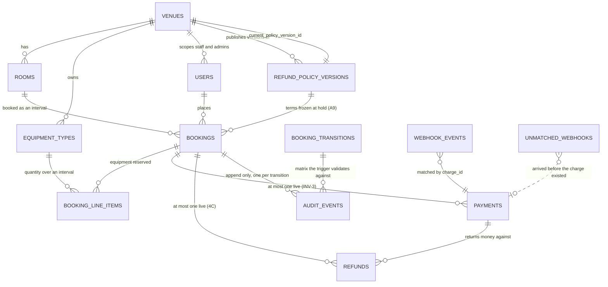
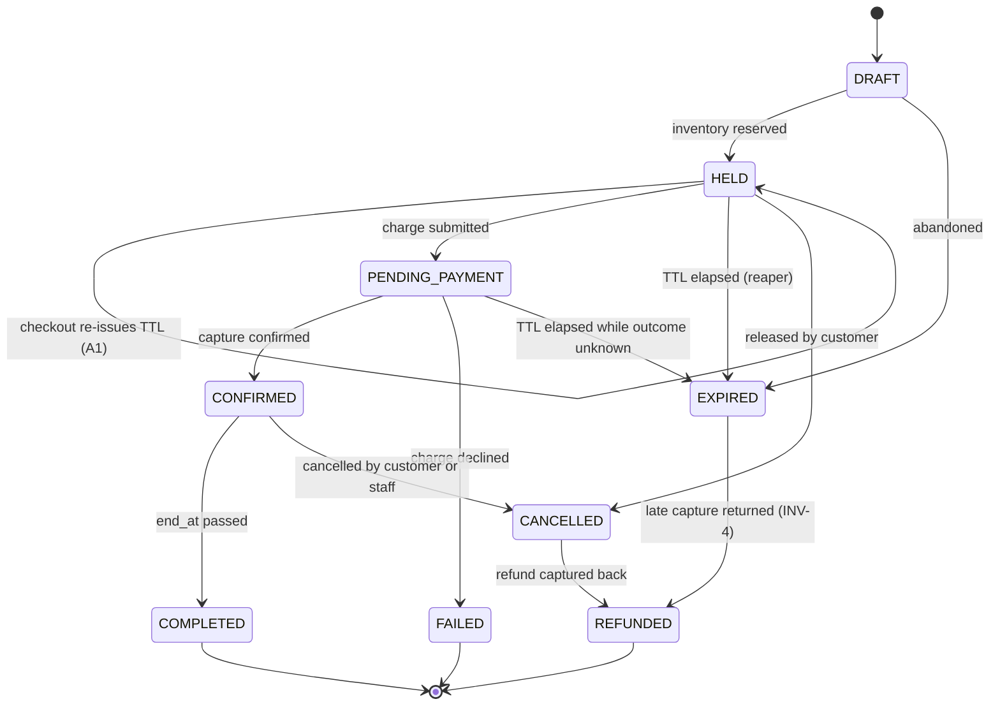

# ARCHITECTURE.md

> **Status: first draft, written before implementation.**
> This is the pre-code design commit required by section 02 ("Design before code").
> No hold endpoint exists in this repository at the time of this commit.
> Sections 1, 2, 5, 7 and 8 are stubs and will be filled as the build proceeds.
> If the final implementation contradicts anything below, the contradiction stays in
> the document with a note on what changed and why. Nothing here gets quietly rewritten.

---

## 0. Stack

Required by section 02 of the brief: the choice justified against at least one rejected
alternative. Placed first because §3 depends on it.

**PostgreSQL — chosen by the design, not by preference.** The concurrency model in §3 is built
on `EXCLUDE USING gist`, range types and generated columns.
*Rejected: MySQL* — no exclusion constraints, so room overlap would fall back to an
application-level check, which is the failure mode the brief names.

**TypeScript + Fastify.**
*Rejected: Python + FastAPI*, an equally good fit for this design. This is a familiarity
decision, not a technical one — under a 24-hour clock and a live defense held without notes,
the stack I write without thinking is the right stack. The cost is that Node's
single-threaded model is awkward for CPU-bound work, which is acceptable here because the
application layer is deliberately thin: the database does the work.

**No ORM and no query builder — plain `pg` with hand-written SQL.**
*Rejected: Prisma* — it cannot express `EXCLUDE USING gist`, generated columns, triggers,
`REVOKE`, or `SELECT ... FOR UPDATE`. All of them would become raw migration SQL,
`schema.prisma` would sit permanently drifted from the real schema, and there would be two
sources of truth. The ORM would be bypassed at exactly the points that matter.
*Kysely was also considered and rejected* — it solves the typing problem without hiding the
SQL, but its codegen is a tool I would be learning today, and in the live defense a repository
file holding the literal SQL Postgres will execute is easier to navigate than a builder API.
The accepted cost is no compile-time checking of column names; mitigated by parameterized
queries throughout, hand-written row interfaces, and an integration test per repository
method.

---

## 1. Entity relationship diagram

Migrations in `db/migrations/`. The diagram is the schema, not a sketch beside it.



### The eight entities the brief names

`VENUES`, `ROOMS`, `EQUIPMENT_TYPES`, `USERS`, `BOOKINGS`, `BOOKING_LINE_ITEMS`, `PAYMENTS`,
`AUDIT_EVENTS` — all present, with the responsibilities described in the brief.

### The five added, and why

| Table | Why it exists |
|---|---|
| `REFUND_POLICY_VERSIONS` | Policy is data, and a change must not reach a booking already made. Append-only versions with the booking holding a pointer is how that guarantee becomes structural rather than remembered — §4B |
| `REFUNDS` | A refund is not a payment with a negative sign. It has its own lifecycle, its own idempotency key, and its own retry state, and INV-5 requires it to be reconcilable independently |
| `WEBHOOK_EVENTS` | Deduplication on `(charge_id, event_type)` needs somewhere to be unique. Also carries the retry state for the worker, since the handler only records and returns — §4 |
| `UNMATCHED_WEBHOOKS` | 25% of deliveries arrive before the charge is recorded. That is an expected condition, so it needs a home other than an error log |
| `BOOKING_TRANSITIONS` | The state machine as data rather than a `CASE` statement, so the matrix can be read, tested and diffed. The trigger validates against it — §3.5 |

### Constraints worth reading as design, not plumbing

| Where | What it prevents |
|---|---|
| `bookings.reserved_range` GENERATED | The 15-minute turnaround becomes geometry. No code path, including seeds, can bypass it |
| `EXCLUDE USING gist` on `bookings` | INV-1, enforced by the index at write time rather than by a prior check |
| `users.role_venue_agreement` | A venue-scoped role with no venue would scope to nothing and read everything; a platform admin with a venue would look scoped and not be. Both are INV-6 failures the database now refuses to store |
| `one_live_charge_per_booking` | INV-3 at the database level, independent of what the application does |
| `one_live_refund_per_booking` | Double-clicked cancel, second line of defence behind the state machine |
| `half_hour_granularity`, `duration_bounds` | Operating rules held as data constraints rather than validation that a new endpoint might skip |
| `REVOKE UPDATE, DELETE` (006) | Append-only for `audit_events`, immutability for policy versions — as privileges, not conventions |

## 2. Booking state machine



### Transition matrix

This is the table the `BEFORE UPDATE` trigger of §3.5 enforces. Any pair not listed raises,
and is mapped to `409`.

| From | To | Trigger | Inventory | Money |
|---|---|---|---|---|
| `DRAFT` | `HELD` | hold created | reserved | — |
| `DRAFT` | `EXPIRED` | abandoned before hold | — | — |
| `HELD` | `HELD` | checkout reached — `expires_at` re-issued (A1) | held | — |
| `HELD` | `PENDING_PAYMENT` | charge submitted | held | charge out |
| `HELD` | `EXPIRED` | TTL elapsed, reaper | released | — |
| `HELD` | `CANCELLED` | customer releases the hold | released | — |
| `PENDING_PAYMENT` | `CONFIRMED` | `charge.succeeded`, hold still live | committed | captured |
| `PENDING_PAYMENT` | `FAILED` | `charge.failed` | released | — |
| `PENDING_PAYMENT` | `EXPIRED` | TTL elapsed, outcome unknown | released | still in flight |
| `CONFIRMED` | `COMPLETED` | `end_at` passed | consumed | — |
| `CONFIRMED` | `CANCELLED` | cancelled | released | refund intent written |
| `CANCELLED` | `REFUNDED` | refund succeeded at Paygate | — | returned |
| `EXPIRED` | `REFUNDED` | late capture on an expired hold (INV-4) | — | returned |

Terminal: `COMPLETED`, `FAILED`, `REFUNDED`, and `CANCELLED` when the policy returns zero.

Blocking states — the ones the exclusion constraint and the equipment peak check count —
are `HELD`, `PENDING_PAYMENT` and `CONFIRMED`.

### Failure edges that matter

The interesting part of this machine is not the happy path but which attempted transitions are
refused, because Paygate's chaos modes produce all of them.

| Attempted | Refused because | Response |
|---|---|---|
| `EXPIRED` → `CONFIRMED` | **INV-4.** A capture arriving after the hold expired must not confirm. The delayed-delivery mode (5%, 60–90s) produces this on every run | refund path, not `409` — see below |
| `CONFIRMED` → `CONFIRMED` | Duplicate webhook delivery (30%). The uniqueness on `(charge_id, event_type)` absorbs it before the transition is attempted | `200`, no-op |
| `CANCELLED` → `CONFIRMED` | Money already returned; the slot may be resold | `409` |
| `CANCELLED` → `CANCELLED` | Repeat cancel. Not an illegal transition — a replay (A11) | `200`, existing refund |
| `COMPLETED` → `CANCELLED` | The booking already happened | `409` |
| `FAILED` → `PENDING_PAYMENT` | A failed charge does not resume; the hold is gone. A new booking is required | `409` |
| `EXPIRED` → `HELD` | The slot was released and may belong to someone else. Re-holding would bypass the exclusion constraint's decision | `409` |

**`EXPIRED` → `CONFIRMED` is the one that is not simply refused.** Rejecting it and stopping
would leave captured money against a booking that will never exist. The webhook handler finds
the booking already `EXPIRED`, does not attempt the transition, writes a refund intent, and
records the whole sequence in `audit_events` — the late arrival, the refusal, and the refund.
The booking then moves `EXPIRED` → `REFUNDED`.

### Where the machine is enforced

Nowhere in the application. The trigger validates `(from_state, to_state)` and writes the
`AuditEvent` in the same statement, so no code path can change state without being checked or
without being audited. See §3.5.

---

## 3. Concurrency strategy

### 3.0 Position

Correctness for both inventory types is enforced **inside PostgreSQL**, not in application
code. Nothing in this design lives in process memory. There is no mutex, no semaphore, no
in-process map of held slots, and no distributed lock service. The single serialization
point is the database, which is the only component shared by all API replicas.

The stated failure mode in the brief — "query for conflicts, then insert" — is a
read-then-write race with a window between the check and the write. Every mechanism below
closes that window by making the check and the write the same operation.

### 3.1 Rooms — GiST exclusion constraint

**Mechanism:** a Postgres `EXCLUDE USING gist` constraint over `(room_id, reserved_range)`,
partial on the three blocking states.

```sql
CREATE EXTENSION IF NOT EXISTS btree_gist;

ALTER TABLE bookings ADD CONSTRAINT no_room_overlap
  EXCLUDE USING gist (
    room_id       WITH =,
    reserved_range WITH &&
  )
  WHERE (status IN ('HELD', 'PENDING_PAYMENT', 'CONFIRMED'));
```

`reserved_range` is a generated `tstzrange` of `[start_at, end_at + 15 minutes)`.

**Why the 15 minutes is inside the range.** The turnaround gap (section 04 operating rules)
is expressed as geometry rather than as a validation branch. Because range overlap is
mutual, extending only the tail is sufficient to enforce the gap on both sides: booking A
ending at 14:00 occupies until 14:15, and booking B starting at 14:10 occupies from 14:10,
so `&&` is true and the second insert is rejected. The buffer therefore cannot be bypassed
by any code path, including seed scripts and admin overrides.

**Why it holds.** The constraint is enforced by the index at write time under the row lock
Postgres takes for the insert. Two concurrent transactions attempting overlapping ranges on
the same room cannot both commit: the second blocks until the first resolves, then either
sees the committed row and raises `23P01` (`exclusion_violation`), or proceeds if the first
rolled back. There is no window between check and write because there is no separate check.
This is a database-level invariant, not a convention — it holds against any client,
including `psql`.

**Mapping to HTTP.** `23P01` is caught at the repository boundary and translated to a clean
`409 Conflict`. It must never surface as a 500. This is the only expected error path for a
lost race, and it is the assertion the 200-request proof depends on.

**Why not the alternatives.**

| Rejected | Reason |
|---|---|
| `SELECT ... WHERE overlaps` then `INSERT` | The named failure mode. Two transactions both read an empty conflict set before either writes. |
| `SERIALIZABLE` isolation + retry | Correct, but pays serialization-failure retries across *all* traffic to protect one table, and under 200 concurrent requests the retry storm is worse than a single index rejection. |
| Advisory lock on `hash(room_id)` | Correct across replicas, but coarser (hash collisions serialize unrelated rooms), and it protects only the paths that remember to take it. |
| Redis / Redlock | Adds a second source of truth that can disagree with Postgres, plus a fencing-token problem on lock expiry. Strictly worse when the database can do it natively. |
| Application mutex / semaphore | Fails on three replicas by construction. |

### 3.2 Equipment — row lock plus interval maximum-concurrency check

Exclusion constraints cannot express "at most N", so equipment needs a different mechanism.

**Mechanism:** inside the same transaction as the booking insert, take
`SELECT ... FROM equipment_types WHERE id = $1 FOR UPDATE`, then run the capacity check,
then insert the line items. The lock is held by Postgres for the transaction's duration and
is released on commit or rollback.

**Why it holds.** All contending transactions for a given `EquipmentType` serialize behind
that single row lock, so the capacity check is evaluated against a stable snapshot that no
concurrent writer can invalidate before commit. The lock is in the database, so it applies
identically regardless of which replica issued the query. Granularity is per equipment type,
so contention is confined to genuinely competing requests.

**The capacity check itself — the part that is easy to get wrong.**

The naive check sums the quantities of every booking overlapping the requested window and
compares that total against units owned. **This is incorrect.** Overlaps are partial, so a
sum over the window counts units that are never simultaneously out. A venue owning 6 cameras
with two 1-camera bookings at 09:00–10:00 and 10:00–11:00 would be charged 2 against a
request spanning 09:00–11:00, when true peak usage is 1.

The correct question is the **maximum concurrent reservation at any instant** inside the
requested interval. Usage is a step function that changes only at booking boundaries, so it
is sufficient to evaluate the candidate points:

- the requested `start_at`, plus
- the `start_at` of every overlapping booking that falls inside the requested window.

At each candidate point, sum the quantities of all bookings covering that instant. The
booking is admissible iff `max(point_sums) + requested_qty <= effective_capacity`.

```sql
WITH points AS (
  SELECT $2::timestamptz AS t
  UNION
  SELECT b.start_at
  FROM   booking_line_items li
  JOIN   bookings b ON b.id = li.booking_id
  WHERE  li.equipment_type_id = $1
    AND  b.status IN ('HELD','PENDING_PAYMENT','CONFIRMED')
    AND  b.start_at >= $2 AND b.start_at < $3
),
peak AS (
  SELECT p.t, COALESCE(SUM(li.quantity), 0) AS units
  FROM   points p
  LEFT JOIN bookings b
    ON b.status IN ('HELD','PENDING_PAYMENT','CONFIRMED')
   AND b.start_at <= p.t AND b.end_at > p.t
  LEFT JOIN booking_line_items li
    ON li.booking_id = b.id AND li.equipment_type_id = $1
  GROUP BY p.t
)
SELECT MAX(units) FROM peak;
```

`effective_capacity = floor(units_owned * (1 + overbooking_buffer))`.

**Why not the alternatives.**

| Rejected | Reason |
|---|---|
| Materialize each physical unit as a row, reuse the room exclusion constraint | Correct by construction and genuinely attractive. Rejected because the 10% overbooking buffer would require creating and destroying phantom unit rows whenever an admin changes the buffer, and because it multiplies row count by unit count on the full profile. Revisit if the row lock becomes a bottleneck. |
| A `units_available` counter column with `UPDATE ... SET n = n - 1 WHERE n > 0` | This is the "stock column" the brief explicitly rules out. A counter has no time dimension and cannot represent 6 cameras out at 10:00 and 6 different cameras out at 14:00. |
| Sum of overlapping quantities | Incorrect as shown above. Fails safe (over-rejects) rather than overselling, so it would not violate INV-2 — but it rejects legitimate bookings, which is a correctness bug in the other direction. |

### 3.3 Behaviour across three replicas behind a load balancer

Neither mechanism has any process-local state, so replica count is irrelevant to correctness.
A request landing on replica 2 contends with a request on replica 3 through exactly the same
index entry and the same row lock it would contend with on a single instance. Adding replicas
changes throughput and lock-wait distribution; it does not change the set of admissible
outcomes.

The concurrency proof therefore runs against nginx fronting three API containers in
`docker compose`, not against a single process. A proof against one instance would not
distinguish this design from an in-memory mutex, which is precisely the distinction being
tested.

Expected result of the 200-request proof: exactly 1 room booking in a blocking state,
`SUM(quantity) <= 3` for the 3-unit equipment type at every instant, and every other request
returning `409`. Zero 5xx. Zero duplicate successes.

Actual run, against `docker compose` with three replicas behind nginx and the demo profile
seeded:

```
target slot: 2026-08-27T09:00:00.000Z -> 2026-08-27T10:00:00.000Z
load balancer: http://localhost:8080
concurrency: 200

PHASE A  one room, one slot, 200 concurrent holds
┌─────────┬────────┐
│ (index) │ Values │
├─────────┼────────┤
│ 201     │ 1      │
│ 409     │ 199    │
└─────────┴────────┘
replicas that served traffic: api-3, api-1, api-2
  PASS  exactly 1 request succeeded
  PASS  exactly 1 booking holds the slot
  PASS  every other request got 409
  PASS  zero 5xx
  PASS  all three replicas participated

PHASE B  200 distinct rooms, one EquipmentType owning 3 units
┌─────────┬────────┐
│ (index) │ Values │
├─────────┼────────┤
│ 201     │ 3      │
│ 409     │ 197    │
└─────────┴────────┘
  PASS  at most 3 units reserved
  PASS  exactly 3 units reserved
  PASS  successes match units
  PASS  zero 5xx
  PASS  no duplicate successes beyond capacity

PROOF PASSED
```

Phase B is the one worth reading twice. Three units owned, three successes, 197 refusals — and
the rooms are all distinct, so nothing but the equipment check could have produced that number.

### 3.4 Expired holds and the reaper

A hold past its TTL but not yet reaped still satisfies the exclusion constraint's `WHERE`
clause, so it continues to block the slot. The predicate cannot reference `now()` — index
predicates must be `IMMUTABLE` — so expiry cannot be pushed into the constraint.

Accepted consequence: the system may **transiently under-sell** (a slot stays blocked for a
few seconds past expiry) but can never **oversell**. That is the correct direction to fail.
A background reaper transitions `HELD` rows past `expires_at` to `EXPIRED` on a short
interval (~15s), which removes them from the partial index and releases the slot. The reaper
is idempotent and safe to run concurrently on all three replicas, since each transition is
guarded by the state machine.

### 3.5 Transition enforcement

`UPDATE bookings SET status = ?` scattered across controllers is called out as a fail, so the
transition matrix is enforced by a `BEFORE UPDATE` trigger that validates
`(from_state, to_state)` and writes the corresponding `AuditEvent` in the same statement.
This makes "exactly one AuditEvent per transition" structurally true rather than
conventionally true, and makes it impossible to change state through a path that forgets to
audit. Illegal transitions raise, and are mapped to `409`.

`UPDATE` and `DELETE` are revoked on `audit_events` at the role level so append-only is a
database guarantee, not a code convention.

> **Found during the build — the claim above was not true as configured.** A role cannot be
> revoked from tables it owns, and the application connects as the owner both under
> `docker compose` and on a free hosting tier where creating a second role is not always
> possible. So migration `006` was protecting nothing in the environment it actually ran in.
> Migration `008` adds `BEFORE UPDATE OR DELETE` triggers that reject the write whichever role
> is connected. Both are kept: the privilege is the right mechanism for production, the trigger
> is the one actually fastened here. The paragraph above is left as written rather than
> corrected, because the gap between the two is the point.
>
> One hole remains and is not closed: row-level triggers do not fire on `TRUNCATE`, and the
> owner has that right — `src/db/seed.ts` uses it. Closing it needs a `BEFORE TRUNCATE`
> statement trigger and a separate migrator role for the seed. Recorded in README.

**Trade-off accepted:** meaningful business logic now lives in the database, which is harder
to unit test and harder for a reviewer to find than a service class. Recorded in
DECISIONS.md.

---

## 4. Payment integrity model

> **Specified, not implemented.** The Paygate build was cut — see TIMELINE and the README
> "Not built" table. What follows is the design as settled, and the schema for it is migrated
> and live (`payments`, `refunds`, `webhook_events`, `unmatched_webhooks`, with
> `one_live_charge_per_booking` and `one_live_refund_per_booking` enforcing INV-3 and the
> refund gate at the database level). No code calls it, so INV-3, INV-4 and INV-5 are
> structurally supported and behaviourally unproven. Reading this section as a description of
> working software would be wrong.

Exactly-once **effect** over an at-least-once, out-of-order channel. Deduplication is on
business effect, not on delivery identity: `X-Paygate-Delivery` is new on every attempt and
is therefore useless as a dedup key. The uniqueness constraint is on
`(charge_id, event_type)`.

- Idempotency key is derived deterministically from the payment attempt and persisted
  *before* the outbound call, so a 500 from `POST /charges` is retried with the same key.
- `UNIQUE (booking_id) WHERE status IN ('PENDING','CAPTURED')` — at most one live charge per
  booking, enforced by the database (INV-3).
- HMAC is verified against the **raw** request body before parsing. Invalid signature → 401,
  logged, never processed.
- Webhook for an unknown charge (the 25% race where the callback beats the 202) is persisted
  to `unmatched_webhooks` and returns 200, then resolved by a sweeper. Never 500, never
  dropped.
- Handler does: verify → dedup insert → enqueue → 200. No heavy work inline.
- INV-4: if the hold has expired when the capture webhook lands, the booking does **not**
  become CONFIRMED. It moves to a terminal cancelled/refunded state, an automatic refund is
  issued under the same idempotency discipline, and the full sequence is audited.
- INV-5: an append-only money ledger. Reconciliation is three anti-joins — captures with no
  CONFIRMED booking, CONFIRMED bookings with no capture, refunds with no matching capture.

## 4A. Tenant isolation model (INV-6)

Numbered 4A so the section numbers the brief asks for keep their positions.

**Mechanism:** every repository method takes an `AuthScope` as its first parameter. There is
no overload without it, so a call that omits the scope does not compile. The scope carries the
caller's role, `user_id` and `venue_id`, and the repository derives the predicate from it —
`venue_id = $1` for venue-scoped roles, `user_id = $1` for `CUSTOMER`, unrestricted for
`PLATFORM_ADMIN`.

```ts
// does not compile
bookingRepo.findById(id)

// the only callable form
bookingRepo.findById(scope, id)
```

**Why it holds.** The failure this invariant is actually exposed to is not a clever attack, it
is a forgotten `WHERE` clause on an endpoint written late in the day. Making the scope a
required parameter moves that failure from review time to compile time, and the check cannot
be skipped because there is no code path that reaches SQL without passing through a repository
method.

Cross-venue reads return `404`, not `403` — see assumption A8. `403` confirms that a resource
exists, which discloses another tenant's data to someone probing by UUID.

**Rejected: Postgres row-level security.** It is the better fit for this design's general
preference for database-enforced guarantees, and it would survive a direct `psql` connection,
which this mechanism does not.

It was rejected because of connection pooling. RLS needs the current tenant set as a session
variable per request; a pooled connection returned to the pool with that variable still set
serves the next request under the previous tenant's scope. That is a **new** isolation failure
mode, created by the mechanism intended to prevent isolation failures, and it sits behind one
of the three scoring hard caps. `SET LOCAL` inside a transaction avoids it, but only if every
path remembers — which is the same forgetting problem, relocated.

Three further costs: `PLATFORM_ADMIN` needs a bypass, the reaper and webhook worker run
unscoped and need another, and `CUSTOMER` scopes by `user_id` rather than `venue_id`, so every
table needs two policies rather than one.

**Accepted cost.** This is a TypeScript guarantee, not a database one. A direct connection
bypasses it entirely. Accepted because the invariant is stated over endpoints — *"through any
endpoint, including by direct ID"* — and the required negative test exercises the API surface.
RLS remains the correct next step and is listed in §8.

---

## 4B. Refund policy model

The brief sets two requirements that pull against each other: policy is **data, not code** — a
venue admin changes tiers through the API and it takes effect immediately with no deployment —
and a policy change **must not retroactively alter the terms of an already CONFIRMED booking**.

**Mechanism: immutable policy versions.** `refund_policy_versions` is append-only. An admin
editing tiers does not update a row; it inserts a new version and the venue's pointer moves to
it. Every booking stores the `policy_version_id` in force when the booking was created, and
the refund calculator reads terms through that reference — never through the venue's current
version.

The platform default is itself a version in the same table, so a venue that has never set a
policy still has a pointer to a real row. There is no separate default branch.

```
v1  48h:100%  24h:50%  0h:0%     ← booking #812 points here, permanently
v2  48h:100%  24h:75%  0h:25%    ← venue's current version
```

**Why it holds.** The guarantee is not that the application declines to apply a new policy
retroactively — it is that the old rows still exist and the booking still points at them.
Nothing needs to remember to behave correctly.

**Rejected: mutable policy rows with the terms copied onto each booking at confirmation.**
Equally correct, and simpler to query since it needs no join. Rejected because it duplicates
the terms on every booking row, and because versioning gives policy history for free, which
matches how `audit_events` is already treated.

**Also rejected: distinguishing a "correction" from a "change".** The tempting version of this
lets an admin fix a typo in place while a genuine policy change creates a new version. It was
rejected because the system cannot verify that a claimed correction is one — `50% → 5%` is
indistinguishable from a typo fix and takes money from customers who already booked. It would
put the decision of whether a change is retroactive in the admin's hands, which turns the
guarantee into a setting. See A10 for how genuine mistakes are handled instead.

---

## 4C. Cancellation and refund idempotency

The thing being made idempotent is not the refund call — it is **the cancellation**. A refund
is a consequence of one, so if a booking can only be cancelled once, it can only be refunded
once.

That guarantee already exists. `CONFIRMED → CANCELLED` runs through the state machine trigger
of §3.5, under the row lock Postgres takes for the update. Two clicks, on any two replicas,
serialize behind that lock; the second finds the booking no longer in `CONFIRMED` and cannot
repeat the transition. No new mechanism is introduced.

**Closing the gap between the transition and the money.** If the transition committed and the
call to Paygate then failed, the booking would be cancelled with no refund issued. So the
refund is not called inline — the *intent* is written in the same transaction as the
transition:

```
one transaction:
  bookings      → CANCELLED         (trigger validates, writes AuditEvent)
  refunds       → INSERT ... status = 'PENDING', amount from the booking's policy version
```

Both commit or neither does. A worker then drives the `PENDING` row to Paygate and may retry
freely, because the `Idempotency-Key` is derived deterministically from the refund row's id.
`UNIQUE (booking_id) WHERE status IN ('PENDING','SUCCEEDED')` on `refunds` is a second line of
defence at the database level.

This also covers INV-4's automatic refund: a late capture on an expired hold and a
user-initiated cancel are both transitions out of the booking's current state, and only one of
them can win.

**Response to a repeated cancel:** `200` with the existing refund, not `409`. See A11.

---

## 4D. Background work

Four jobs run outside the request path: the hold reaper, the refund driver, webhook
processing, and the unmatched-webhook sweeper.

**Mechanism: Postgres tables polled with `FOR UPDATE SKIP LOCKED`.** No queue service.

```sql
SELECT * FROM refunds WHERE status = 'PENDING'
FOR UPDATE SKIP LOCKED LIMIT 10;
```

`SKIP LOCKED` passes over rows another transaction already holds, so three replicas polling
the same table take disjoint work without waiting on each other.

**Why, over Redis and BullMQ.** A queue outside the database makes enqueueing a second write:
commit the booking, then enqueue the job. If the process dies between them, the booking is
cancelled and the refund job never existed — money lost silently, which is INV-5 inverted. In
one database the job row and the business change are the same commit.

Retries are an `attempts` and `next_attempt_at` column; a row exhausting its attempts becomes
`FAILED` and surfaces in the reconciliation report rather than disappearing.

**Cost accepted:** polling latency of roughly one second, and three replicas each issuing a
poll per second.

**The worker runs inside the API process**, not as a separate container — a second service on
the free tier sleeps independently, and `SKIP LOCKED` already makes three concurrent workers
safe. Consequence for the deployed demo: the host sleeps after 15 minutes idle, so the reaper
stops with it. Holds made just before sleep are reaped on wake. Noted in the README so it is
not read as a defect.

---

## 5. Indexing and query strategy

Indexes are in `db/migrations/007_indexes.sql`. EXPLAIN evidence is in `LOAD_TEST.md`.

### The one index that does double duty

The GiST index backing the exclusion constraint is also the availability index. Asking "is
this room free between 14:00 and 16:00" and asking "may this booking be inserted" are the same
range-overlap question, so availability reads and the write-time check share one structure.
Nothing extra is maintained to answer availability.

### Cross-venue search

Five filters combine: city, minimum capacity, amenity set, price ceiling, and an availability
window. The shape is: reduce candidate rooms with the cheap filters first, then test
availability against the smallest possible set.

```sql
SELECT r.*
FROM   rooms r
WHERE  r.city = $1
  AND  r.capacity >= $2
  AND  r.amenities @> $3::text[]
  AND  r.hourly_rate_minor <= $4
  AND  NOT EXISTS (
         SELECT 1 FROM bookings b
         WHERE  b.room_id = r.id
           AND  b.status IN ('HELD','PENDING_PAYMENT','CONFIRMED')
           AND  b.reserved_range && tstzrange($5, $6, '[)')
       );
```

Availability is last on purpose. It is the only predicate that touches the large table —
250,000 bookings against 800 rooms on the full profile — so every room eliminated first is a
range lookup not performed.

### A correction to the pre-code draft

The first draft of this section proposed a composite btree on
`(city, capacity, hourly_rate_minor)`. **That third column is wasted and the index shipped is
`(city, capacity)` instead.**

A btree can use columns after a range predicate only for filtering, not for seeking. Here
`city` is equality, but `capacity >= $2` and `hourly_rate_minor <= $4` are both ranges. After
`capacity`, the scan is already walking a range, so `hourly_rate_minor` never narrows it — it
only makes the index larger and slower to maintain.

Price is left as a filter on the reduced set. Whether that is sufficient, or whether the
planner should be steered toward a `BitmapAnd` of `rooms_search_idx` with the amenities GIN,
is a question for `EXPLAIN ANALYZE` against `--profile=full` rather than for reasoning. The
draft is left above rather than rewritten, per §02 of the brief.

### Expected plan

City and capacity seek `rooms_search_idx`; the amenity containment is either a GIN bitmap
combined with that or a recheck on the heap, depending on selectivity; the anti-join is an
index-only probe of the partial GiST index per surviving room.

### Measurements

`--profile=full` was not run and there are no p50/p95/p99 numbers. What was measured on the
demo profile, and what it does and does not settle, is in [`LOAD_TEST.md`](./LOAD_TEST.md).

Two results belong here because they bear on the plan predicted above.

The availability anti-join behaved as expected: an `Index Only Scan` on the partial GiST index
with a single heap fetch. That half of the design holds.

The room filter did not. The planner drove the query from `rooms_amenities_idx` and pushed
city, capacity and price down to a heap filter — and `rooms_search_idx` shows `idx_scan = 0`,
meaning it has never been used at all. That is not evidence against the index: with 64 seeded
rooms the whole table is two heap blocks and no index choice can lose. It does mean the open
question above is still open, and that demo scale cannot close it.

---

## 6. Assumptions

Ambiguities resolved independently. **The permitted batch of clarifying questions was
deliberately not sent** — every ambiguity below was resolvable on defensible grounds, and the
brief treats a documented assumption as earning credit where silence earns none. The cost of
that choice is that any divergence from the client's intent is absorbed here rather than
corrected early; A1 is the entry most exposed, since the two numbers it reconciles are
incompatible as written and admit more than one reasonable resolution. Reasoning recorded in
`TIMELINE.md`.

| # | Ambiguity | Resolution |
|---|---|---|
| A1 | Hold TTL is 8 minutes (section 04) but customers must get at least 10 minutes at checkout without losing the slot. These are incompatible as written. | Reaching checkout re-issues the hold with `expires_at = now() + 10 minutes`. The 8-minute TTL governs a hold that never reaches checkout. The slot is therefore never lost inside the guaranteed window. |
| A2 | INV-1 forbids room double-booking "under any circumstances", but a 10% overbooking buffer is permitted on "any inventory". | The buffer applies to **EquipmentType only**. For a single-unit room, 10% of 1 floors to 0 regardless, so the rules are reconciled rather than overridden. Rooms are structurally excluded from buffer logic. |
| A3 | Does the overbooking buffer apply to held inventory or only confirmed? | Applies to effective capacity in all blocking states, so held units count against the buffered ceiling. |
| A4 | Venues span Karachi, Dubai and London; London observes DST. | All timestamps stored as `timestamptz` in UTC. Every venue carries an IANA timezone. Operating-hours checks and the 48h / 24h / 2h refund boundaries are evaluated in **venue-local** time. |
| A5 | Must the 15-minute room turnaround fit inside published operating hours? | No. The gap is turnaround, not occupancy, and may extend past closing. |
| A6 | May a booking mix a room from one venue with equipment from another? | No. Line items must belong to the room's venue. Enforced as a check at hold creation. |
| A7 | Is partial equipment fulfilment acceptable? | No. A line item is all-or-nothing; insufficient units rejects the whole hold with a 409. |
| A8 | Cross-venue access: 403 or 404? | **404** on reads, to avoid disclosing the existence of another venue's resources by ID. 403 is reserved for in-venue privilege failures (e.g. VENUE_STAFF attempting a pricing change). |
| A9 | The brief protects an "already CONFIRMED" booking from a policy change, but does not say which policy applies if the tiers change between hold and confirmation. | The `policy_version_id` is captured at **hold creation**, not at confirmation. The customer is shown terms at checkout and pays against them within minutes; binding at confirmation could apply terms they were never shown. This is stricter than the brief requires, and never weaker. |
| A10 | Policy versions are immutable, so a genuine admin mistake cannot be corrected for bookings already made under it. What happens then? | It is treated as an operations problem, not a schema one. The wrong version stays; the affected booking receives an explicit, audited adjustment recorded as its own money movement. Silently rewriting the policy would hide the correction from the reconciliation report, which INV-5 exists to make impossible. |
| A11 | The brief requires a clean `409` for an illegal transition. Is cancelling an already-cancelled booking illegal? | **No — it returns `200` with the existing refund.** Read literally, an illegal transition is a `(from, to)` pair absent from the matrix. Asking for a state the booking is already in is not a transition at all; it is a replay of one that succeeded, and answering it with the original result is what idempotency means. `409` is reserved for a genuine request to move somewhere the machine does not allow, such as `CANCELLED → CONFIRMED`. The distinction is whether the caller is asking for the same outcome again or for a different one. |

## 7. What breaks at 100x

Measured on the demo profile — 24,680 bookings, `shared_buffers` 128 MB — and extrapolated to
25 million, which is 100x the full profile. Sizes below are real `pg_relation_size` readings.

### 1. The GiST exclusion index stops fitting in shared buffers

`no_room_overlap` is 1,592 kB at 24,680 bookings. At 25 million that is roughly **1.6 GB**
against 128 MB of shared buffers, and a managed free tier will not be more generous.

This matters more here than a cold index usually would, because of *when* the index is read.
The exclusion check runs inside the hold transaction, and a conflicting inserter waits on the
winner while holding its own transaction open. Once the index is disk-resident that wait grows
by a random read — and the 200-request proof already showed that when waits lengthen, Postgres
starts resolving them as deadlocks (`40P01`, §3.3 and `AI_LOG` 16). The retry path absorbs that
today. It would not absorb it at ten times the wait.

**Remedy:** range-partition `bookings` by month on `start_at`. The exclusion constraint then
lives per partition and only the current and next month is hot, so the working set stays flat
however much history accumulates. The honest catch: a partitioned exclusion constraint must
include the partition key, so a booking spanning a boundary is not covered. Maximum duration is
8 hours, so that is only bookings crossing midnight on the last day of a month — they need
either a coarser boundary or a small unpartitioned overlap table checked alongside.

### 2. The equipment peak check scans a set that grows with the table

Not a projection. `EXPLAIN ANALYZE` on the peak query at 24,680 bookings:

```
->  Nested Loop Left Join
      Join Filter: ((b.start_at <= now()) AND (b.end_at > now()))
      Rows Removed by Join Filter: 12740
```

**12,740 rows examined and discarded** to price one hold, on a table of 24,680. No index serves
interval containment for the active statuses, so the join degenerates into a filter. At 25
million bookings that is on the order of **13 million rows discarded per hold** — and it happens
while holding `FOR UPDATE` on the `equipment_types` row, so it is not merely slow, it is slow
while blocking every other hold for that equipment type.

The mechanism in §3.2 is still correct. The query implementing it is not indexed for the shape
it actually runs.

**Remedy:** drive the join from `booking_line_items` rather than from `bookings`.
`line_items_equipment_idx (equipment_type_id, booking_id)` already exists and cuts the candidate
set to that one equipment type before `bookings` is touched. If that is still too wide, add a
GiST index on `tstzrange(start_at, end_at)` partial on the three active statuses, which turns
containment into a range lookup — the same tool INV-1 already uses.

### 3. `audit_events` grows about five times faster than `bookings`

It is 1:1 today — 24,680 rows against 24,680 bookings — but only because seeded bookings never
move. A real booking walks `HELD → PENDING_PAYMENT → CONFIRMED → COMPLETED`, and every edge
writes a row from inside the state-machine trigger. At 25 million bookings that is on the order
of **125 million audit rows**, each an INSERT plus btree maintenance on
`audit_events_booking_idx (booking_id, occurred_at)` in the same transaction as the state
change. The audit trail sits on the write path of every transition, so its size is a tax on
throughput, not just on storage.

**Remedy:** range-partition `audit_events` by `occurred_at` and detach old partitions to cold
storage. Nothing reads the whole table — per-booking history is bounded by the booking, and INV-5
reconciliation needs only a recent window. Detaching does not violate append-only: the rows are
moved, never modified.

### Not on this list, and why

`bookings_reaper_idx` is 16 kB and stays that way by construction. It is partial on `HELD`, and
a `HELD` row is either taken or reaped within minutes, so it indexes the queue rather than the
history and does not grow with the table.

## 8. What I would do with two more weeks

Priority order, and the first item is not close.

**1. Paygate and the payment path.** The largest hole in the submission. Three of the six
invariants — INV-3, INV-4, INV-5 — rest on constraints that nothing exercises, so they are
asserted rather than demonstrated. Order inside it: mock provider with the brief's chaos modes;
`POST /bookings/:id/checkout` persisting the derived idempotency key *before* the outbound call;
the webhook handler (HMAC on the raw body, dedup insert on `(charge_id, event_type)`, 200, no
work inline); the `SKIP LOCKED` worker that drives transitions; the sweeper for
`unmatched_webhooks`. INV-4 falls out of the last step — a capture landing against an expired
hold routes to refund instead of to `CONFIRMED`.

**2. Cancellation, the refund calculator, the reconciliation endpoint.** §4B and §4C are
designed, policy versions are migrated, and every booking already points at the version in force
— the terms are frozen correctly and nothing reads them. Reconciliation is three anti-joins, and
is what turns "money is never silently lost" from a claim into a query anyone can run.

**3. The reaper.** Small, and currently the reason an abandoned hold blocks its slot forever
rather than for seconds. §3.4 is written; it is a guarded `UPDATE` on a short interval.

**4. Fix what §7 measured.** The equipment join order is a small change with a large effect and
should not wait for partitioning.

**5. Row-level security.** §4A chose repository scoping over RLS on a pooling argument that still
holds, and recorded RLS as the next step. With `SET LOCAL` now proven safe by the audit trigger,
the pooling objection is answerable, and RLS would put INV-6 in the database beside INV-1 and
INV-2 instead of leaving it in the type system.

**6. `--profile=full`, the benchmark, and `LOAD_TEST.md` with real numbers.** §5 carries a
strategy with no measurements behind it. `LOAD_TEST.md` records exactly what is unmeasured.

**7. Close the `TRUNCATE` hole** in the append-only guarantee — a `BEFORE TRUNCATE` statement
trigger plus a dedicated migrator role so the seed can still do its job.
